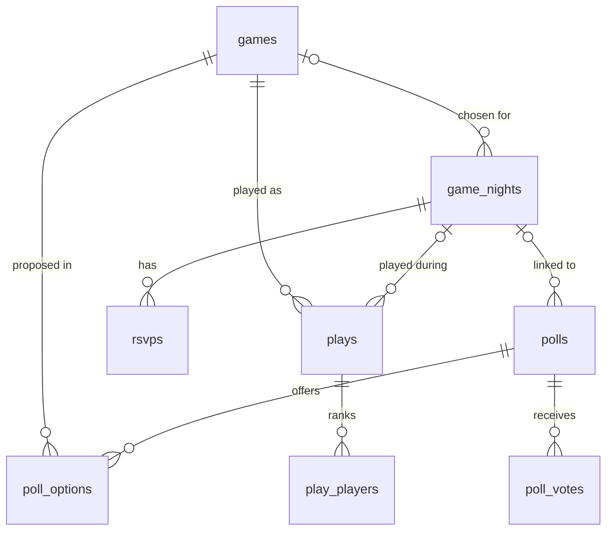

# Meeple Night

**Meeple Night** is a Discord bot for board game groups: organize game nights with RSVP and reminders, vote on which game to play, import the group's collection from [MyLudo](https://www.myludo.fr), track plays and rank players with a multiplayer Elo rating.

Bilingual: every command, option and message is available in **English** and **French**. Private replies follow each user's Discord language; public messages (nights, votes, reminders) follow the server's language, set with `/settings language`.


## Features

| Feature | Commands (EN / FR) | Highlights |
| --- | --- | --- |
| **Game nights** | `/gamenight create · edit · list · cancel`<br>`/soiree creer · modifier · liste · annuler` | RSVP buttons (going / maybe / can't), seat limit with automatic waitlist, weekly or biweekly repetition, *Calendar* button (.ics file), mirrored as a Discord event when allowed. Attendees are pinged when a night changes or is cancelled, and when a seat opens up for them. RSVP closes when the night starts |
| **Reminders** | automatic | Pings attendees twice before the night (24 h and 2 h by default, configurable per server) |
| **Collection** | `/collection import · list · info · add · remove`<br>`/collection importer · liste · info · ajouter · retirer` | Imports a MyLudo JSON export (base games and standalones), re-import updates without duplicates, optional sync, games added by hand, paginated list filtered by player count and duration. Removed games keep their plays |
| **Game vote** | `/vote start · pick`<br>`/vote lancer · choisir` | Filters games by player count (the night's attendees by default) and duration range, then either draws some at random or lists them all to tick the ones to offer. Approval voting via a select menu, live tally, automatic closing, random tie-break, optionally attendees only. The winner becomes the night's game |
| **Plays** | `/play record · from_night · history · undo`<br>`/partie enregistrer · depuis_soiree · historique · annuler` | Players in finishing order, optional scores (ties supported), Elo change of each player. From a night: a form prefilled with the attendees. Only participants or organizers can record a play |
| **Ranking** | `/leaderboard` · `/classement` | Elo ranking overall or per game, provisional players (fewer than 3 plays by default) hidden |
| **Settings** | `/settings` · `/reglages` | Per server: timezone, organizer role, reminder delays, language of public messages (requires *Manage Server*) |

## Architecture

```
src/
├── domain/        Pure business logic, no Discord or database dependency (unit tested)
│   ├── elo.ts         Multiplayer Elo, standings
│   ├── myludo.ts      MyLudo export parser
│   ├── voting.ts      Candidate selection, approval tally
│   ├── reminders.ts   Due reminders, attendance / waitlist, promotions
│   ├── dates.ts       Timezone-aware date parsing (DST safe, no date library)
│   ├── schedule.ts    Recurring nights
│   ├── ics.ts         iCalendar (.ics) export
│   └── play-ranking.ts  Finishing order typed in the "from a night" form
├── db/            Drizzle schema and SQLite client (migrations applied at startup)
├── repositories/  Database access per aggregate (integration tested on in-memory SQLite)
├── commands/      Slash commands (one folder per command with subcommands)
├── components/    Button, select menu and modal handlers
├── ui/            Embed and component rendering, channel notices
├── scheduler/     Minute loop: reminders, started nights, due votes
├── i18n/          English and French messages, command localizations
├── bot/           Router, registration, permissions, Discord events, downloads
├── backup.ts      Daily SQLite copies
├── health.ts      /health endpoint and gateway watchdog
├── renewal.ts     Optional reminder to renew a free hosting plan
└── log.ts         JSON logs
```

Design choices:

- **Ratings are derived, not stored.** The Elo ranking is recomputed by replaying the play history in order. It stays consistent if a play is ever corrected or removed, and it is cheap at the scale of a group of friends.
- **Multiplayer Elo.** A play with *n* players counts as every pairwise duel between them, with the K factor divided by *n − 1*, so a play weighs the same whatever the number of players. Ties count as draws.
- **Stateless interactions.** Buttons, menus and forms carry their target in their custom id (`rsvp:<night>:<answer>`, `poll:<poll>:select`, `colpage:<page>:<filters>`), so they keep working after a restart. The `/vote pick` list goes further: the ticked games are read back from its own menus.
- **No privileged intents.** The bot only needs the `Guilds` intent: everything goes through slash commands and components.
- **Dates.** Dates typed in commands are read in the server's timezone (`/settings timezone`), then displayed with Discord timestamps, which each client renders in its own locale and timezone.
- **Abuse-resistant by default.** User text is escaped before being shown (no fake links or mentions), members can open at most 5 upcoming nights and 3 votes (organizers are not limited), and a play can only be recorded by one of its players or an organizer.
- **Resilient loop.** Reminders are retried after a transient Discord error and dropped only when the channel is gone or inaccessible.

### Data model



Every table is scoped by Discord server (`guild_id`), so one instance serves several servers; `guild_settings` holds each server's preferences. The only exception is `bot_state`, a key-value table for the instance itself (the hosting renewal tracking).

## Getting started

Requirements: Node.js 24+.

1. Create an application and a bot on the [Discord Developer Portal](https://discord.com/developers/applications), then invite it with the `bot` and `applications.commands` scopes (permissions: *Send Messages*, *Embed Links*, *Attach Files*, *View Channels*; optionally *Create Events* to mirror nights as Discord events).
2. Configure the environment:

   ```sh
   cp .env.example .env   # fill DISCORD_TOKEN and DISCORD_CLIENT_ID
   npm install
   npm run dev
   ```

   Set `DISCORD_GUILD_ID` during development: commands are registered on that server only and show up instantly.

3. In Discord, export your collection from MyLudo (JSON) and run `/collection import` with the file (requires *Manage Server* or the organizer role).
4. Optionally run `/settings organizer_role` to let a role manage nights, votes and the collection, `/settings timezone` if the server is not in the default timezone, and `/settings language` to pick the language of public messages (by default the Discord server language, which only Community servers can change, so English otherwise).

### Environment variables

| Variable | Default | Description |
| --- | --- | --- |
| `DISCORD_TOKEN`, `DISCORD_CLIENT_ID` | — | Required |
| `DISCORD_GUILD_ID` | — | Register commands on one server (instant, for development) |
| `DATABASE_PATH` | `./data/bot.db` | SQLite file |
| `TIMEZONE` | `Europe/Paris` | Default timezone, overridable per server |
| `BACKUP_DIR` / `BACKUP_KEEP` | `<db folder>/backups` / `7` | Daily database copies; `BACKUP_KEEP=0` disables them |
| `HEALTH_PORT` | disabled | Serves `GET /health` (200 when connected to Discord, 503 otherwise) |
| `RENEWAL_USER_ID` | disabled | Discord user who gets the [renewal reminder](#renewal-reminder) by direct message |
| `RENEWAL_DAYS` / `RENEWAL_URL` / `RENEWAL_LOCALE` | `4` / — / `en` | Days a renewal lasts, link to the hosting panel, language of the reminder (`en` or `fr`) |

### Scripts

| Script | Description |
| --- | --- |
| `npm run dev` | Run with hot reload |
| `npm test` | Unit and integration tests (Vitest) |
| `npm run check` | Lint, typecheck, tests and build, as in CI |
| `npm run db:generate` | Generate a migration after a schema change |

## Deployment (Fly.io)

The bot runs as a single always-on machine with a volume for the SQLite file.

```sh
fly launch --no-deploy --copy-config
fly volumes create bot_data --size 1 --region cdg
fly secrets set DISCORD_TOKEN=... DISCORD_CLIENT_ID=...
fly deploy --ha=false
```

Keep a single machine: two instances would open two gateway sessions and write to separate databases.

The container starts as root only to take ownership of the volume, then runs as the unprivileged `node` user. Fly checks `GET /health` on the internal port 8080 (nothing is exposed publicly), and the bot exits if its Discord session stays down for 5 minutes, so the machine gets restarted.

### Backups

Two layers protect the data:

- **Daily copies** of the database in `/data/backups` (the 7 latest are kept), made with SQLite's online backup while the bot runs. They cover a bad command or migration.
- **Fly volume snapshots** (daily, kept a few days) cover the loss of the volume: `fly volumes snapshots list`.

To restore a copy: stop the machine, replace `/data/bot.db` with `/data/backups/bot-<date>.db` (for example through `fly ssh console`), delete `bot.db-wal` and `bot.db-shm`, then start it again.

## Deployment (panel host: KataBump, Pterodactyl)

Free bot hosts built on a Pterodactyl panel (such as [KataBump](https://katabump.com)) run `node index.js` and often offer no way to set environment variables. The root [`index.js`](index.js) covers both: it loads a `.env` file if there is one, then starts the compiled bot.

1. Create a Node.js server and pick a **Node.js 24** Docker image in *Startup*; keep the JS file on `index.js`.
2. Build locally with `npm run build`, then upload `index.js`, `dist/`, `drizzle/`, `package.json` and `package-lock.json` through the *Files* tab. Leave `node_modules` out: the panel installs the dependencies for its own platform.
3. Create a `.env` file next to them (`DISCORD_TOKEN`, `DISCORD_CLIENT_ID`, `DATABASE_PATH=./data/bot.db`; see [`.env.example`](.env.example)) and start the server.

To update, rebuild and upload `dist/` again (and `drizzle/` after a schema change): `.env` and `data/` stay in place. Download a copy from `data/backups/` from time to time, since a free server can be lost with its disk.

### Renewal reminder

Free plans must often be renewed by hand every few days. With `RENEWAL_USER_ID` set, the bot sends that user a direct message a day before the deadline, then every 12 hours until they click **Renewed**, which starts a new cycle. The first start counts as a renewal. The renewal itself stays manual: the reminder only makes sure it is not forgotten.

## Data and privacy

The bot stores only what its features need, per server: Discord user ids (RSVPs, votes, plays), the texts typed in commands (night titles, locations) and the imported collection. No message content is read. When the bot is removed from a server, everything stored for that server is deleted.

## License

MIT
