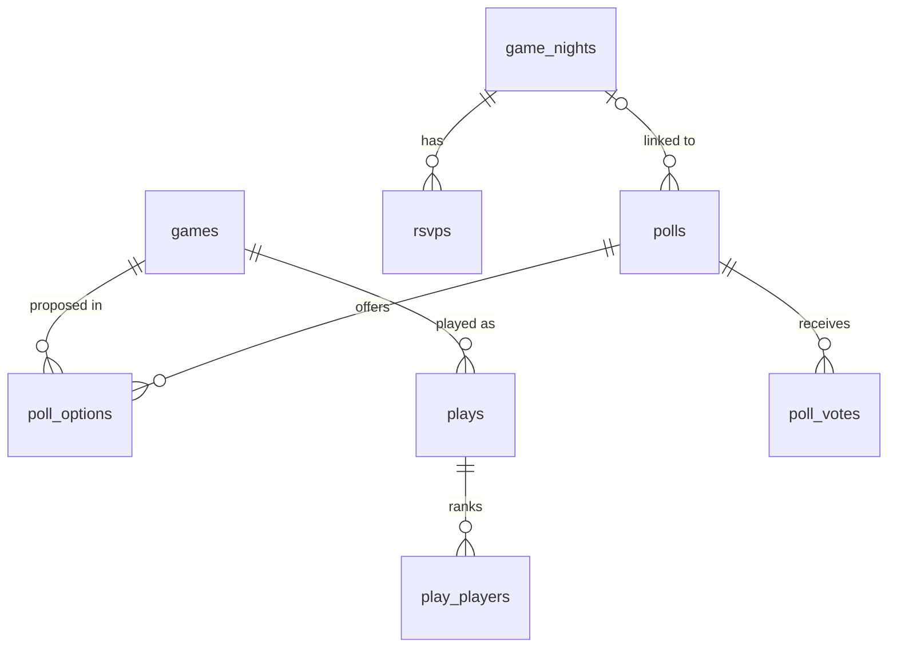

# Meeple Night

**Meeple Night** is a Discord bot for board game groups: organize game nights with RSVP and reminders, vote on which game to play, import the group's collection from [MyLudo](https://www.myludo.fr), track plays and rank players with a multiplayer Elo rating.

Bilingual: every command, option and message is available in **English** and **French**, following each user's Discord language.


## Features

| Feature | Commands (EN / FR) | Highlights |
| --- | --- | --- |
| **Game nights** | `/gamenight create · list · cancel`<br>`/soiree creer · liste · annuler` | RSVP buttons (going / maybe / can't), seat limit with automatic waitlist, dates shown in each viewer's timezone |
| **Reminders** | automatic | Pings attendees the day before and 2 hours before |
| **Collection** | `/collection import · list · info`<br>`/collection importer · liste · info` | Imports a MyLudo JSON export (base games and standalones), re-import updates without duplicates, filters by player count and duration |
| **Game vote** | `/vote start` · `/vote lancer` | Picks random games fitting the night's attendee count, approval voting via a select menu, live tally |
| **Plays** | `/play record` · `/partie enregistrer` | Players in finishing order, optional scores (ties supported), shows the Elo change of each player |
| **Ranking** | `/leaderboard` · `/classement` | Elo ranking overall or per game |

## Architecture

```
src/
├── domain/        Pure business logic, no Discord or database dependency (unit tested)
│   ├── elo.ts         Multiplayer Elo, standings
│   ├── myludo.ts      MyLudo export parser
│   ├── voting.ts      Candidate selection, approval tally
│   ├── reminders.ts   Due reminders, attendance / waitlist
│   └── dates.ts       Timezone-aware date parsing (DST safe, no date library)
├── db/            Drizzle schema and SQLite client (migrations applied at startup)
├── repositories/  Database access per aggregate (integration tested on in-memory SQLite)
├── commands/      Slash commands
├── components/    Button and select menu handlers
├── ui/            Embed and component rendering
├── scheduler/     Reminder loop
├── i18n/          English and French messages, command localizations
└── bot/           Router, command registration, shared types
```

Design choices:

- **Ratings are derived, not stored.** The Elo ranking is recomputed by replaying the play history in order. It stays consistent if a play is ever corrected or removed, and it is cheap at the scale of a group of friends.
- **Multiplayer Elo.** A play with *n* players counts as every pairwise duel between them, with the K factor divided by *n − 1*, so a play weighs the same whatever the number of players. Ties count as draws.
- **Stateless interactions.** Buttons and menus carry their target in their custom id (`rsvp:<night>:<answer>`, `poll:<poll>:select`), so they keep working after a restart.
- **No privileged intents.** The bot only needs the `Guilds` intent: everything goes through slash commands and components.
- **Dates.** Dates typed in commands are read in the configured timezone, then displayed with Discord timestamps, which each client renders in its own locale and timezone.

### Data model



Every table is scoped by Discord server (`guild_id`), so one instance serves several servers.

## Getting started

Requirements: Node.js 24+.

1. Create an application and a bot on the [Discord Developer Portal](https://discord.com/developers/applications), then invite it with the `bot` and `applications.commands` scopes (permissions: *Send Messages*, *Embed Links*, *View Channels*).
2. Configure the environment:

   ```sh
   cp .env.example .env   # fill DISCORD_TOKEN and DISCORD_CLIENT_ID
   npm install
   npm run dev
   ```

   Set `DISCORD_GUILD_ID` during development: commands are registered on that server only and show up instantly.

3. In Discord, export your collection from MyLudo (JSON) and run `/collection import` with the file (requires the *Manage Server* permission).

### Scripts

| Script | Description |
| --- | --- |
| `npm run dev` | Run with hot reload |
| `npm test` | Unit and integration tests (Vitest) |
| `npm run check` | Lint, typecheck, tests and build, as in CI |
| `npm run db:generate` | Generate a migration after a schema change |

## Deployment (Fly.io)

The bot runs as a single always-on machine with a volume for the SQLite file.

```sh
fly launch --no-deploy --copy-config
fly volumes create bot_data --size 1 --region cdg
fly secrets set DISCORD_TOKEN=... DISCORD_CLIENT_ID=...
fly deploy --ha=false
```

Keep a single machine: two instances would open two gateway sessions and write to separate databases.

## License

MIT
